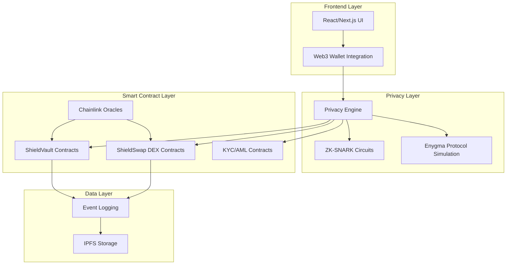

# Shield - Technical Specification

### Project Overview
**Shield** is a comprehensive DeFi ecosystem featuring privacy-preserving financial infrastructure for institutional and retail users. The project consists of two main components:

1. **ShieldVault** - Modular DeFi vault protocol with privacy-preserving features
2. **ShieldSwap** - Decentralized exchange with enhanced privacy and compliance

### System Architecture



### Core Features

#### ShieldVault Features
- **Private Deposits/Withdrawals**: Using ZK-SNARKs to hide transaction amounts and user identities
- **Multi-Asset Support**: Support for RWAs, stablecoins, and traditional DeFi tokens
- **Yield Optimization**: Automated strategies connecting to various DeFi protocols
- **Compliance Integration**: On-chain KYC/AML with selective disclosure
- **MEV Protection**: Private mempool and transaction batching
- **Cross-Chain Support**: Bridges to Rayls infrastructure

#### ShieldSwap Features
- **Private Trading**: Zero-knowledge proofs for trade privacy
- **Liquidity Pools**: Private liquidity provision with hidden amounts
- **Advanced Orders**: Limit orders, stop-loss with privacy protection
- **Institutional Features**: Large block trading with privacy
- **Compliance**: Built-in regulatory reporting capabilities

#### Privacy & Security
- **Enygma Integration**: Simulation of Rayls' privacy protocol
- **ZK-SNARK Implementation**: Using Circom for circuit development
- **Confidential Transactions**: Hidden amounts and trading strategies
- **Selective Disclosure**: ZK-based compliance reporting
- **MEV Resistance**: Private order routing and batching

### Technical Stack

#### Frontend
- **Framework**: Next.js 14 with TypeScript
- **Styling**: Tailwind CSS + shadcn/ui
- **Web3**: wagmi + viem for Ethereum integration
- **State Management**: Zustand
- **Charts**: Recharts for analytics
- **Animations**: Framer Motion

#### Smart Contracts
- **Language**: Solidity ^0.8.19
- **Framework**: Hardhat
- **Standards**: ERC20, ERC721, ERC1155, ERC4626 (vault standard)
- **Oracles**: Chainlink Price Feeds
- **Upgrades**: OpenZeppelin upgradeable contracts

#### Privacy Implementation
- **ZK Framework**: Circom 2.0
- **Proof System**: Groth16 via snarkjs
- **Privacy Concepts**: Commitment schemes, nullifiers, merkle trees
- **Enygma Simulation**: Mock implementation of Rayls privacy features

#### Infrastructure
- **Blockchain**: Ethereum (initially), Rayls compatibility
- **Storage**: IPFS for metadata
- **APIs**: Graph Protocol for indexing
- **Deployment**: Vercel (frontend), testnet deployment

### Privacy Architecture

#### ZK Circuit Design
1. **Deposit Circuit**
   - Inputs: amount, asset_type, user_commitment
   - Public: vault_address, merkle_root
   - Private: amount, user_secret, nullifier

2. **Withdrawal Circuit**
   - Inputs: amount, nullifier, merkle_proof
   - Public: vault_address, merkle_root, nullifier_hash
   - Private: amount, user_secret

3. **Trading Circuit**
   - Inputs: trade_amount, from_asset, to_asset
   - Public: dex_address, price_commitment
   - Private: actual_amounts, trading_strategy

#### Enygma Protocol Simulation
```solidity
// Simplified Enygma privacy wrapper
contract EnygmaPrivacy {
    mapping(bytes32 => bool) public nullifierHashes;
    mapping(bytes32 => bool) public commitments;
    
    function submitPrivateTransaction(
        uint256[2] memory proof_a,
        uint256[2][2] memory proof_b,
        uint256[2] memory proof_c,
        bytes32 nullifier,
        bytes32 commitment
    ) external;
}
```

### User Journeys

#### Institution Onboarding
1. **KYC Registration**: Institutional verification with ZK identity
2. **Compliance Setup**: Configure reporting and audit parameters
3. **Vault Creation**: Deploy private institutional vault
4. **Asset Integration**: Connect RWA tokens and traditional assets

#### Retail User Flow
1. **Simple KYC**: Streamlined verification for retail users
2. **Vault Selection**: Choose from public and semi-private vaults
3. **Private Deposits**: Deposit assets with hidden amounts
4. **Yield Tracking**: Monitor returns privately

#### Trading Flow
1. **Private Order**: Submit trading order with ZK proof
2. **MEV Protection**: Order batching and private routing
3. **Execution**: Trade execution with privacy preservation
4. **Settlement**: Private settlement with audit trail

### API Architecture

#### Vault API
```typescript
interface VaultAPI {
  // Vault operations
  createVault(params: VaultParams): Promise<VaultAddress>;
  deposit(vaultId: string, proof: ZKProof): Promise<TxHash>;
  withdraw(vaultId: string, proof: ZKProof): Promise<TxHash>;
  getBalance(vaultId: string, userKey: string): Promise<PrivateBalance>;
  
  // Privacy operations
  generateDepositProof(amount: bigint, secret: string): Promise<ZKProof>;
  generateWithdrawProof(amount: bigint, nullifier: string): Promise<ZKProof>;
}
```

#### DEX API
```typescript
interface DEXApi {
  // Trading operations
  submitPrivateOrder(order: PrivateOrder): Promise<OrderId>;
  getPrivateOrderBook(pair: TradingPair): Promise<PrivateOrderBook>;
  executePrivateTrade(proof: ZKProof): Promise<TradeResult>;
  
  // Liquidity operations
  provideLiquidity(proof: ZKProof): Promise<LPTokens>;
  removeLiquidity(proof: ZKProof): Promise<Assets>;
}
```

### Security Considerations

#### Smart Contract Security
- **Reentrancy Protection**: ReentrancyGuard on all state-changing functions
- **Access Control**: Role-based permissions with timelock
- **Upgrade Safety**: Transparent proxy pattern with multi-sig
- **Oracle Security**: Multiple price feeds with deviation checks

#### Privacy Security
- **Circuit Audits**: Formal verification of ZK circuits
- **Trusted Setup**: Ceremony for production deployment
- **Side-Channel Protection**: Constant-time operations
- **Metadata Leakage**: Minimize on-chain footprint

### Testing Strategy

#### Unit Tests
- Smart contract functionality (100% coverage target)
- ZK circuit correctness
- Frontend component testing

#### Integration Tests
- End-to-end user workflows
- Cross-contract interactions
- Privacy preservation validation

#### Security Tests
- Fuzzing for smart contracts
- ZK soundness testing
- Privacy leak detection

### Deployment Plan

#### Phase 1: Local Development
- Smart contract deployment on local network
- ZK circuit compilation and testing
- Frontend integration

#### Phase 2: Testnet Deployment
- Deploy on Ethereum testnet (Sepolia)
- Public testing and feedback
- Security audit preparation

#### Phase 3: Rayls Integration
- Adapt contracts for Rayls compatibility
- Integrate with actual Enygma protocol
- Production deployment

### Hackathon Deliverables

1. **Functional Prototype**: Working ShieldVault and ShieldSwap
2. **Privacy Demo**: ZK-SNARK integration with simulated privacy
3. **User Interface**: Polished frontend with all features
4. **Technical Documentation**: Complete system documentation
5. **Demo Video**: Comprehensive feature demonstration

### Success Metrics

- **Functionality**: All core features working end-to-end
- **Privacy**: ZK proofs correctly implemented and verified
- **User Experience**: Intuitive interface for both institutions and retail
- **Performance**: Sub-5 second transaction times
- **Security**: No vulnerabilities in smart contracts or ZK circuits

### Future Enhancements

- **Real RWA Integration**: Connect with bond and equity tokens
- **Advanced Privacy**: Implement full Enygma protocol features
- **Cross-Chain**: Deploy on multiple blockchain networks
- **Compliance Tools**: Advanced reporting and audit features
- **Institutional APIs**: White-label solutions for financial institutions
